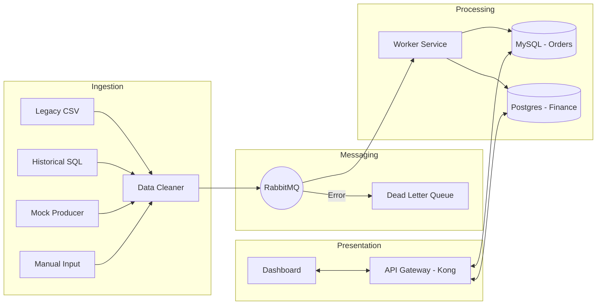

# 🏗️ NOAH - Retail Integration System (Hệ thống Tích hợp Dữ liệu Bán lẻ)

> **NOAH** là một hệ thống backend tích hợp toàn diện, được thiết kế để xử lý, làm sạch và đồng bộ hóa dữ liệu từ các nguồn cũ (Legacy CSV, SQL) sang kiến trúc hiện đại dựa trên Microservices. Hệ thống sử dụng **Event-Driven Architecture** với RabbitMQ làm trung tâm điều phối và Kong Gateway làm cửa ngõ bảo mật.

---

## 🌟 Tính năng mới cập nhật (Updated Features)

Hệ thống vừa được nâng cấp với các tính năng cao cấp nhằm đảm bảo tính ổn định và toàn vẹn dữ liệu:

1.  **🚀 Kiến trúc Event-Driven (RabbitMQ):**
    *   Tách rời hoàn toàn (Decoupling) giữa nguồn dữ liệu và hệ thống xử lý.
    *   Hỗ trợ **Dead Letter Queue (DLQ)**: Các tin nhắn lỗi được tự động chuyển sang hàng đợi riêng (`failed_orders`) để xử lý sau, đảm bảo không mất dữ liệu.
    *   Cơ chế **Auto-Retry**: Tự động thử lại khi gặp sự cố kết nối Database.

2.  **🛡️ Kong API Gateway:**
    *   **Rate Limiting**: Giới hạn 60 yêu cầu/phút để chống spam.
    *   **Security**: Mọi truy cập vào dữ liệu nhạy cảm đều được bảo vệ bằng API Key.
    *   **Abstraction**: Người dùng chỉ cần kết nối qua một cổng duy nhất (Port 8000).

3.  **💎 Toàn vẹn dữ liệu & Chống trùng lặp (Idempotency):**
    *   Sử dụng mã băm **SHA-256** dựa trên nội dung đơn hàng để tạo `message_id` duy nhất.
    *   Đảm bảo một đơn hàng dù được gửi nhiều lần cũng chỉ được lưu đúng 1 bản ghi vào Database.

4.  **🧹 Data Quality Gate (Làm sạch dữ liệu):**
    *   Tự động sửa lỗi số lượng âm (Negative Numbers) từ hệ thống cũ thành số tuyệt đối.
    *   Chuẩn hóa định dạng ngày tháng và xử lý trường dữ liệu bị thiếu.
    *   Ghi log chi tiết các bản ghi "bẩn" (Dirty Data) để đối soát.

5.  **📊 Đối soát đa Database (Reconciliation):**
    *   Ghi đồng thời vào **MySQL** (E-commerce) và **PostgreSQL** (Finance).
    *   Hệ thống tự động so sánh số lượng bản ghi giữa hai DB để phát hiện sai lệch thời gian thực ngay trên Dashboard.

---

## 🌊 Luồng hoạt động (System Workflow)



---

## 📂 Cấu trúc thư mục

```text
noah-system/
├── api/             # Flask Backend, Dashboard & Business Logic
├── worker/          # Service xử lý hàng đợi và ghi Database
├── producer/        # Script giả lập đơn hàng liên tục (Stress Test)
├── legacy/          # Logic đọc/làm sạch file CSV cũ
├── db/              # Script khởi tạo SQL (MySQL & Postgres)
├── docker-compose.yml # "Nhạc trưởng" điều phối 9 container
└── requirements.txt # Thư viện Python cần thiết
```

---

## 🚀 Hướng dẫn triển khai nhanh

### 1. Khởi động toàn bộ hệ thống
Bạn cần cài đặt Docker và Docker Desktop. Chạy lệnh sau tại thư mục gốc:
```bash
docker compose up --build -d
```
*Hệ thống sẽ khởi tạo 9 dịch vụ: MySQL, Postgres, RabbitMQ, Kong, API, Worker, Producer...*

### 2. Các địa chỉ truy cập quan trọng
*   **Hệ thống Dashboard:** [http://localhost:5000](http://localhost:5000) (Giám sát toàn bộ luồng dữ liệu)
*   **Báo cáo Đối soát:** [http://localhost:5000/report](http://localhost:5000/report) (Xem chênh lệch giữa các DB)
*   **API Gateway (Kong):** [http://localhost:8000/api/sales](http://localhost:8000/api/sales)
*   **RabbitMQ Management:** [http://localhost:15672](http://localhost:15672) (u: guest | p: guest)

---

## 🛠️ Xử lý sự cố (Troubleshooting)

| Vấn đề | Nguyên nhân | Cách khắc phục |
| :--- | :--- | :--- |
| **Worker không hiển thị log** | Python buffering log | Đảm bảo `PYTHONUNBUFFERED: "1"` trong file compose. |
| **Dữ liệu không vào DB** | Worker đang tắt hoặc lỗi | Kiểm tra `docker ps`, nếu worker die hãy check `docker logs noah-worker`. |
| **Lỗi kết nối Kong** | Kong chưa khởi động xong | Đợi 30s sau khi chạy docker-compose để Kong hoàn thành migration. |
| **RabbitMQ báo đỏ** | Hết RAM hoặc Disk | Giải phóng dung lượng ổ đĩa và restart container. |

---

## 👥 Thông tin dự án

*   **Đồ án:** Tích hợp hệ thống dữ liệu bán lẻ đa nguồn (NOAH System).
*   **Môn học:** CMUCS 445 - Platform Integration Systems.
*   **Nhóm:** Team 1 - CMU-CS (Đại học Duy Tân).

---
*Hệ thống được thiết kế để chịu tải cao và kháng lỗi (Resilient). Bạn có thể thử tắt bất kỳ dịch vụ nào (như Worker) và bật lại sau để thấy RabbitMQ giữ dữ liệu an toàn như thế nào!*
